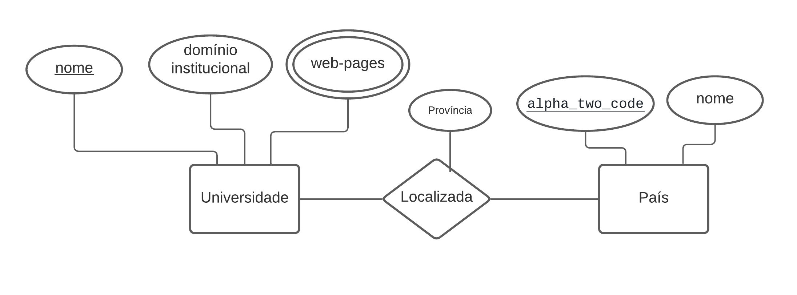

# Lab01 - API Acesso

# Aluno
* `Lucas de Paula Soares - RA201867`

## Estrutura de pastas:
~~~
├── README.md  <- arquivo apresentando a tarefa
│
├── images     <- arquivo de imagem da tarefa
│
└── notebook   <- arquivos do notebook
~~~

## Tarefa 1 sobre APIs de acesso

> [Jupyter Notebook do Laboratório 1](notebook/)

## Tarefa 2 sobre Engenharia Reversa
> 
