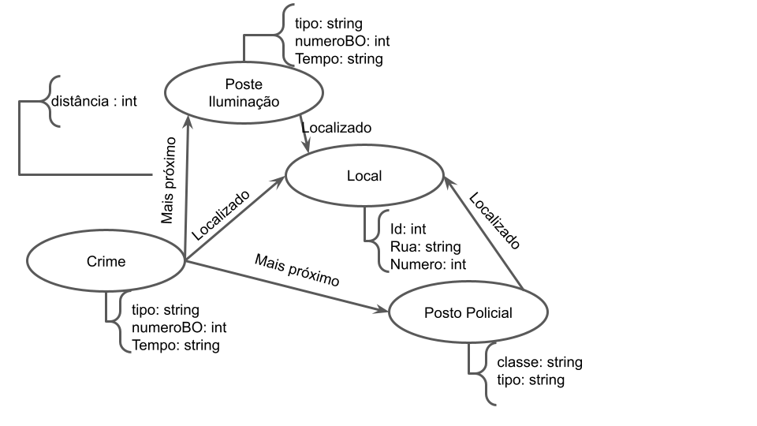

# Lab07 - Modelo Lógico para Banco de Dados de Grafos

Estrutura de pastas:

~~~
├── README.md  <- arquivo apresentando a tarefa
│
└── images     <- arquivos de imagem usados na tarefa
~~~

# Aluno
* ` 201867 `: ` Lucas de Paula Soares `

## Modelo Lógico do Banco de Dados de Grafos

## Perguntas de Pesquisa/análise

> * Quais os nós de Locais com maior clustering coeficient para vizinhos sendo do tipo Crime?  (tal pergunta poderia indicar locais hotspots de ocorrências)
> * Qual será o próximo nó do tipo crime mais provável de se ocorrer? (tal pergunta poderia ajudar a definir rotas policiais para se fazer o patrulhamento) 
> * Qual a porcentagem de crimes que ocorreram de noite a uma distância menor ou igual a 5m de um poste de iluminação? (tal pergunta pode ajudar a responder se a iluminação pública realmente está ligada a criminalidade) 