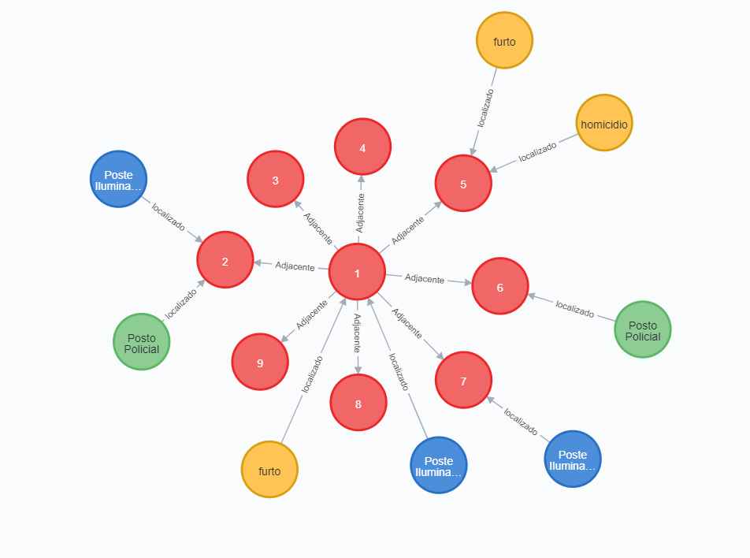

# Lab09 - Banco de Dados de Grafos

Estrutura de pastas:

~~~
├── README.md  <- arquivo apresentando a tarefa
│
└── images     <- arquivos de imagem usados na tarefa
~~~

# Aluno
* ` 201867 `: ` Lucas de Paula Soares `

## Exemplo do Banco de Dados de Grafos - grafo de conhecimento

Através do exemplo notamos as triplas (recurso, propriedade, valor) e também (recurso, propriedade, recurso). Por exemplo, entre quadrantes de localização no mapa, temos a tripla (quadrante1, adjacente, quadrante2). Para crimes no quadrante temos a tripla (crime1, localizado, quadrante1). Temos também as triplas envolvendo postos policiais e um quadrante, e poste de iluminação com quadrante, (posto policial 1, localizado, quadrante2), (poste iluminação1, localizado, quadrante2). Lembrando que nó `quadrante` representa um quadrado abrangendo um certo intervalo de coordenadas, em vez de um nó `local`, que representava apenas um par de coordenadas. Assim, podemos fazer análises mais significativas em relação a locais e distâncias. Os dados seriam disponibilizados como um grafo de conhecimento com estas triplas especificadas acima.
 

### Pergunta 1
> Quais quadrantes são mais perigosos? 

* Será feita a análise de proximidade do quadrante com relação a crimes, ou seja, para cada quadrante será calculada a distância mínima dele para todos os nós de crime. Utilizarei a fórmula de *closeness centrality* para todos os nós de quadrante de forma que os que possuem uma centralidade maior são mais perigosos.

### Pergunta 2
> Qual a relação entre o grau de iluminação de um  quadrante e a quantidade de crimes que ocorrem dentro dele?

 * Será feita a análise de centralidade de grau (*degree centrality*) para os quadrantes tanto com relação aos nós de postes quanto com relação aos nós de crime. Assim, será feita a comparação entre esses dois valores para cada um dos quadrantes, de forma a tentar detectar um relação entre esses índices.

### Pergunta 3
> Qual a relação entre a quantidade de crimes e a distância para postos policiais?

* Será feita a análise de centralidade de grau dos quadrantes em relação aos nós de crimes. Será computado o (*closeness centrality*) dos quadrantes com relação aos postos policiais. Assim, será feita a comparação desses índices, de forma a tentar detectar uma possível relação.
